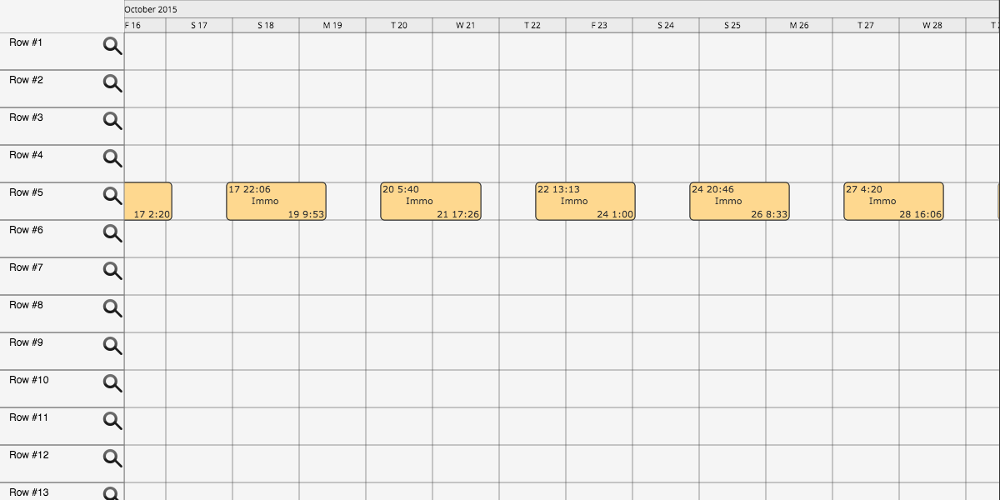

Planning-canvas
===============

This is an attempt at a full featured planning made using javascript, the HTML5 canvas and the
[LokiJS](http://lokijs.org/) database.

DOCS
----

* JSDoc generated [documentation](http://idk.tn/github/machour/planning-canvas/), including tutorials.

TODO
----

* Fix scrolling issues (horizontal)
* Enable mouse wheel interactions:
  * Scroll
  * Zoom when CTRL is held
* Implement Planning.goToDate()
* Snap items horizontally to intervals when moving (.00, .15, ..)
* Detect and prevent collisions
* Disabled items
* Disabled row areas
* Current row highlighting
* Item creation
* Row filtering using LokiJs queries
* Stateful items (providing different styles for statuses)
* Add more events handler on Item() (mouseover, mouseleave, ..)
